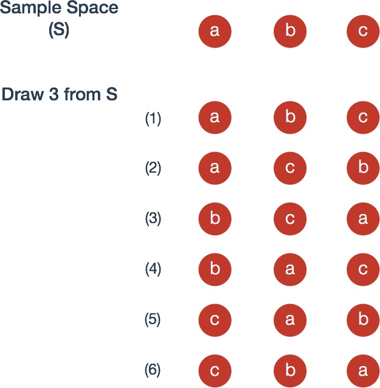
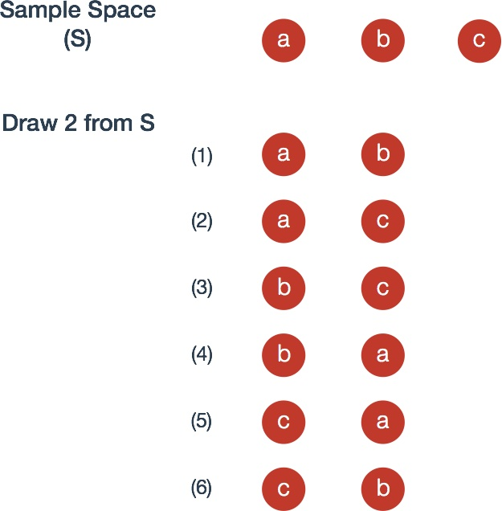
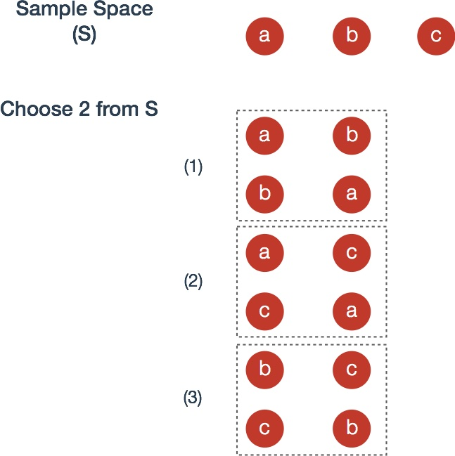

## <a href="#permutations" name="permutations">Permutations</a>

Suppose that $$n$$ **distinct** objects are drawn sequentially, ordered from left to right in  row. Keep in mind that **order matters** and that objects are drawn *without replacement*, that is, the pool of objects to be drawn from decreases with each selection.

1. The number of ways to arrange $$n$$ distinct objects in a row is

	$$n(n-1)(n-2)\dotsm(2)(1)=n!$$

	where the $$!$$ symbol is described as "factorial".

	For example, consider three numbered balls; They can be arranged $$3!= (3)(2) = 6$$ different ways.

	  {: .img-responsive.flat style="max-height:400px" }

2. The number of ways to arrange $$r$$ objects selected from $$n$$ distinct objects is

	$$n(n-1)(n-2)\dotsm(n-r+1)=n^{(r)}$$

	where the $$n^{(r)}$$ notation describes "n taken to r terms". An alternative expression for this is

	$$n^{(r)}=n(n-1)\dotsm(n-r+1)[\frac{(n-r)(n-r-1)\dotsm(2)(1)}{(n-r)(n-r-1)\dotsm(2)(1)}]=\frac{n!}{(n-r!)}$$

	For example, consider again three numbered balls; Two balls can be arranged $$\frac{3!}{(3-2)!}=6$$ different ways.

  {: .img-responsive.flat style="max-height:400px" }

***
 

## <a href="#combinations" name="combinations"> Combinations </a>

Suppose that **order does not matter** and as before, objects are drawn *without replacement*.

Now, the number of ways to *choose* $$r$$ objects from n distinct objects is

$$\binom{n}{r}=\frac{n!}{r!(n-r)!}=\frac{n(n-1)\dotsm(n-r+1)(n-r)(n-r-1)\dotsm(2)(1)}{r!(n-r)(n-r-1)\dotsm(2)(1)}=\frac{n^{(r)}}{r!}$$

where the $$\binom{n}{r}$$ symbol is "n choose r".

**Proof** From [permutations](#permutations) rule 2,  recall that the ways we can arrange $$r$$ objects from $$n$$ objects is $$n^{(r)}$$. Any choice of $$r$$ objects can be ordered $$r!$$ different ways. It follows that

$$(\text{number of ways to choose r from n})\cdot r!=n^{(r)}$$

Concretely, the image below is nearly identical to the example for [permutations](#permutations) rule 2 except that, since order is ignored, we group those with identical elements with a dotted box, leaving three events rather than the previous six

  {: .img-responsive.flat style="max-height:400px" }
